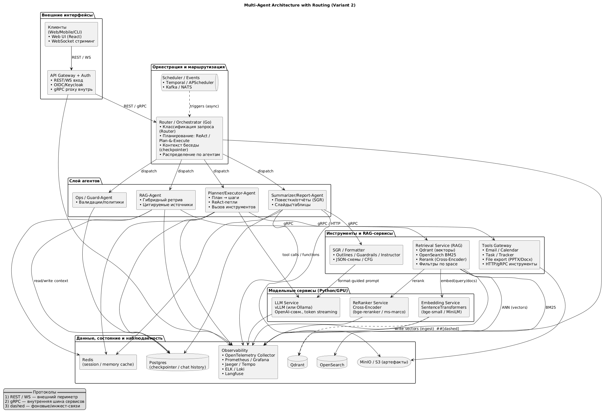

## Конкретные компоненты по модулям

1) Orchestration & агенты (ядро)
	•	Router / Orchestrator (Go)
	•	gRPC-контракты (protobuf), OpenTelemetry SDK.
	•	Маршрутизация: простые правила + ML-классификатор позже (zero-shot MNLI / BERT-классификатор).
	•	Планирование: ReAct / Plan-&-Execute; поддержка ветвлений и пауз.
	•	Где описывать граф/состояние:
	•	LangGraph (Python) как runtime для прототипов и сложных цепочек + checkpointer (Postgres/Redis).
	•	Прод: логику графа переносим в Go (state-machine) при сохранении API; сложные цепочки оставляем в Py-воркфлоу.
	•	Состояние диалогов: Postgres (долговременная память), Redis (сессии/кэш), язык ключа {org:team:channel:thread}.
	•	Шина событий/планировщик фона: Temporal (надежные долгие процессы) или APScheduler + NATS/Kafka на события.

2) RAG/пайплайны и документы (индекс/поиск)
	•	Ингест/парсинг (Py): pymupdf, pdfplumber, python-docx, pandas/openpyxl; нормализация → Markdown.
	•	Векторная БД: Qdrant (HNSW, фильтры по space/project, payload).
	•	BM25/ключевой поиск: OpenSearch (или легкий Whoosh для MVP).
	•	Реранкер: sentence-transformers bge-reranker-base/large или cross-encoder/ms-marco-MiniLM.
	•	Ретрив-сервис: gRPC/REST с гибридом (dense+BM25) и RRF, фильтры по метаданным, top-k, цитирование источников.

3) Строго структурированные ответы / SGR
	•	Форматирование/валидация:
	•	Outlines (CFG-guided decoding) — JSON по схеме/шаблоны отчётов.
	•	Guardrails / Instructor (Pydantic) — валидация и автопочинка вывода.
	•	Сервис sgr-formatter (Py): принимает черновик ответа от LLM → «прогон» по схеме → валидированный JSON/Markdown/Docx.

4) Мультиагентность / групповые диалоги
	•	Специализированные агенты (Py—runtime, Go-оркестрация):
	•	RAG-Agent — извлечение контекста/цитаты.
	•	Planner/Executor-Agent — ReAct-петли, вызов инструментов (email, calendar, tasks, экспорт).
	•	Summarizer/Report-Agent — повестки/отчёты/слайды (через SGR).
	•	Ops/Guard-Agent — проверки, политика безопасности, пост-валидация.
	•	Групповые комнаты:
	•	Для R&D: AutoGen GroupChat / CrewAI (несколько ролей в сессии).
	•	Прод: храним авторов/ролей в БД + Router решает, кто «говорит», шлём широковещательно в WebSocket-канал.

5) Сервис моделей (офлайн)
	•	LLM-сервер:
	•	vLLM (OpenAI-совместимый endpoint, KV-cache, батчинг),
	•	Dev/Edge: Ollama.
	•	Эмбеддинги: sentence-transformers (all-MiniLM-L6-v2, bge-small) в отдельном сервисе embed.
	•	Реранкер: отдельный сервис reranker (cross-encoder).
	•	Оптимизации: FP8/INT4, paged-attention, токен-стриминг. Go-оркестратор обращается к ним по gRPC/REST.

6) Наблюдаемость / трейсинг
	•	OpenTelemetry Collector (трейсы/метрики/логи) →
	•	Prometheus/Grafana (метрики),
	•	Jaeger/Tempo (трейсы),
	•	ELK или Loki (логи),
	•	Langfuse (трейсинг LLM-шагов, промптов, токенов).
	•	Корреляция по trace-id от Gateway до LLM; логируем источники RAG, схему SGR, tool-calls, затраты токенов.

⸻

## Протоколы и языки
	•	Внешний периметр: REST + WebSocket (стриминг токенов/промежуточных шагов).
	•	Внутри кластера: gRPC (Go↔Py сервисы, модели, ретрив, форматтер).
	•	Языки: Go — маршрутизатор, API, state-машины; Python — ML-сервисы (LLM/Embed/Rerank/SGR), ingest.

⸻

## Стек агента: рекомендованные и альтернативные опции

| Блок           | Опция A (рекоменд.)                         | Опция B                                                         |
|----------------|----------------------------------------------|------------------------------------------------------------------|
| Оркестрация    | Go + LangGraph (Py) checkpointer             | Полностью на Go (state-machine), Py только для ML                |
| Векторка       | Qdrant                                       | Weaviate / Milvus                                                |
| BM25           | OpenSearch                                   | Tantivy-бэкенды (Meilisearch) / Whoosh (MVP)                     |
| Реранк         | bge-reranker / cross-encoder / ms-marco      | ColBERT-v2 (отдельный сервис)                                   |
| Эмбеддинг      | all-MiniLM-L6-v2 / bge-small                 | E5-small / InstructorXL (дороже)                                 |
| LLM-сервер     | vLLM                                         | HF TGI / llama.cpp (через server) / Ollama                       |
| SGR            | Outlines + Guardrails                        | Guidance / Instructor                                            |
| Планировщик    | Temporal                                     | APScheduler + NATS / Kafka                                       |
| Observability  | OTel + Prometheus / Grafana + Jaeger + Langfuse | OTel + ELK / Loki без Langfuse                                   |


⸻

## Что именно закрывается вашими кейсами
	•	Мультидокумент и разнородные источники: Retrieval Service (Qdrant+BM25+Rerank) + RAG-Agent.
	•	Планы/дедлайны/зависимости: Planner/Executor с инструментами calendar, tasks, date-calc + SGR-схемы Milestone{...}.
	•	Контекст чата и групповые каналы: хранение истории в Postgres/Redis; широковещание в WebSocket-канал; GroupChat-паттерн.
	•	Расшаривание результатов: артефакты (JSON/MD/PPTX) в MinIO/S3 + ссылки в канал.
	•	Фоновые агенты: Temporal запускает воркфлоу агента по крону/событию (дайджесты, «поставь на контроль»).
	•	Строгие отчёты/повестки: Summarizer/Report-Agent → SGR/Formatter → Docx/PPTX экспорт.

⸻

## Мультиагентная архитектура с маршрутизацией



## Детальная deploy-схема


## DevOps-требования для полностью офлайн-развёртывания с «библиотекой моделей»

1) Базовая инфраструктура
	•	GPU-узлы: NVIDIA драйверы (R555+ для новых RTX), NVIDIA Container Toolkit, nvidia-container-runtime; тест nvidia-smi в контейнере.
	•	Контейнерный реестр (офлайн): Harbor / Nexus / Artifactory — локальные зеркала всех образов (qdrant, opensearch, vllm, otel, jaeger, prom, grafana, langfuse, keycloak, и ваши сервисы).
	•	Зеркала пакетов: внутренние репозитории apt/yum, внутренний PyPI (devpi/Nexus), внутренний npm (Verdaccio/Nexus). Сборка образов должна не ходить в интернет.
	•	Секреты/конфиги: Vault/Sealed-Secrets/Ansible Vault; в Compose/Helm — через env-файлы и Secret-хранилище.

2) «Библиотека моделей» (offline model hub)
	•	Хранилище моделей: MinIO/S3 (s3://models/) или выделенный каталог на NFS/зеркале.
	•	Индекс моделей: models.toml / index.json со схемой:
```toml
[llm.default]   # алиас
path="/models/llama3-8b-instruct"
format="hf"       # hf|gguf|safetensors
max_context=8192

[embed.minilm]
path="/models/sentence-transformers/all-MiniLM-L6-v2"

[rerank.bge]
path="/models/BAAI/bge-reranker-base"
```

### Загрузка/снапшоты offline:
	•	huggingface_hub snapshot-download → в MinIO/каталог (с --local-dir).
	•	Храните safetensors/gguf + tokenizer.json.
	•	Для Ollama — ollama pull в подготовительном окружении → экспорт ~/.ollama как артефакт.
	•	Для vLLM — кладите HF-папки «как есть», указывайте локальный путь --model /models/<id>.
### Переменные окружения:
	•	Для Py/Transformers: HF_HOME=/models_cache, TRANSFORMERS_CACHE=/models_cache, при необходимости HF_ENDPOINT=http://hf.mirror.local (если делаете внутреннее зеркала HF).
	•	Для сервисов: MODEL_DIR=/models (смонтировать read-only).
### Версионирование моделей: модельные каталоги иммутабельны (добавляйте -v1, -v2), алиасы в models.toml переключают актуальную версию.
	•	Тест-плейбуки: smoke-скрипты: /healthz, completion на 10 токенов, embed на 1 строку, rerank на 3 кандидата — все без сети.

3) Сборка и публикация образов (offline)
	•	Prebake: соберите образы vllm, embed, reranker, sgr-formatter с уже прогретыми wheel-кешами и без сетевых скачиваний.
	•	Wheelhouse: заранее соберите колёса (pip wheel -r requirements.txt) и кладите в внутренний PyPI.
	•	Node: npm-registry mirror (Verdaccio), lock-файлы + npm ci без сети.

4) Конфигурация сервисов к «библиотеке моделей»
	•	vLLM:
	•	Монтируйте - /srv/models:/models:ro.
	•	Команда: --model /models/llama3-8b-instruct --dtype auto --max-model-len 8192.
	•	При необходимости несколько воркеров и пины по NUMA/PCIe.
	•	Ollama: восстановите ~/.ollama из артефакта или импортируйте *.gguf в runtime (ollama create).
	•	Embed/Reranker/SGR: конфиги читают MODEL_DIR + имя модели из models.toml.

5) Данные и персистентность
	•	Qdrant: отдельный SSD-том, регулярные snapshot’ы (S3/MinIO); настройте ef_construct, m под объёмы.
	•	OpenSearch: JVM-лимиты, memlock, снапшоты в MinIO; индексы с префиксами workspace.
	•	Postgres/Redis: бэкапы (pg_dump + wal-архив), Redis persistence (RDB/AOF) при необходимости.
	•	MinIO: версии артефактов (версирование бакета).

6) Наблюдаемость/алёртинг
	•	OTel Collector конфиг (OTLP gRPC/HTTP) → Jaeger/Tempo + Prometheus Remote-write (опционально).
	•	Метрики: p50/p95/p99 latency для: Retrieval, LLM-prefill/decoding, токены/сек (throughput), RPS, GPU-util/VRAM, очередь Router.
	•	Дашборды Grafana:
	•	LLM: токены/сек, queue size, cache-hit, VRAM, ошибки.
	•	RAG: hit-rate ретрива, средняя длина контекста, rerank latency.
	•	Router/Agents: средние шаги/запрос, time-per-tool, % ошибок/таймаутов.
	•	Алёрты: GPU-util >95% длительно, VRAM >90%, p99 LLM > SLA, Qdrant latency > SLA, доля ошибок > X%.

7) Безопасность и доступ
	•	Keycloak / OIDC: токены в Gateway; mTLS на внутренних gRPC между критичными сервисами.
	•	ACL по space/project в Retrieval (фильтры по payload), Router проверяет права.
	•	Supply-chain: подпись образов (cosign), политики admission (OPA/Gatekeeper/kyverno), SBOM (syft/grype).

8) Путь к Kubernetes (если планируете)
	•	nodeSelectors/taints для GPU нод; runtimeClassName: nvidia.
	•	PV/PVC для Qdrant/OpenSearch/Postgres/MinIO.
	•	Helm-чарты на каждый сервис; общий values для MODEL_DIR, probes, ресурсы.
	•	HPA/VPA для Router/Retrieval; PDB/affinity.
	•	Canary для LLM/агентов — по заголовку/флагу.

⸻