# Диаграммы архитектуры контроля доступа

## 🏗️ Общая архитектура системы с ACL

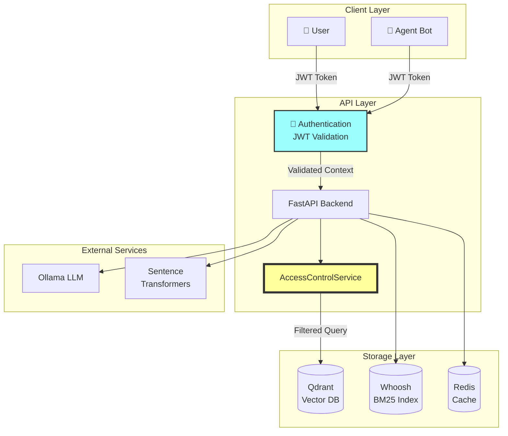

## 🔄 Поток запроса с контролем доступа

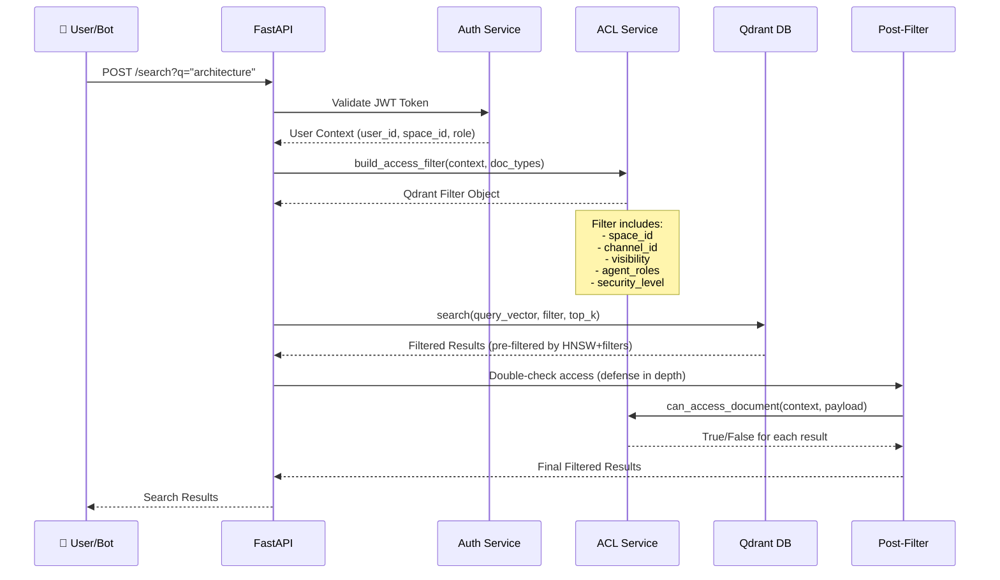

## 🗄️ Структура данных в Qdrant

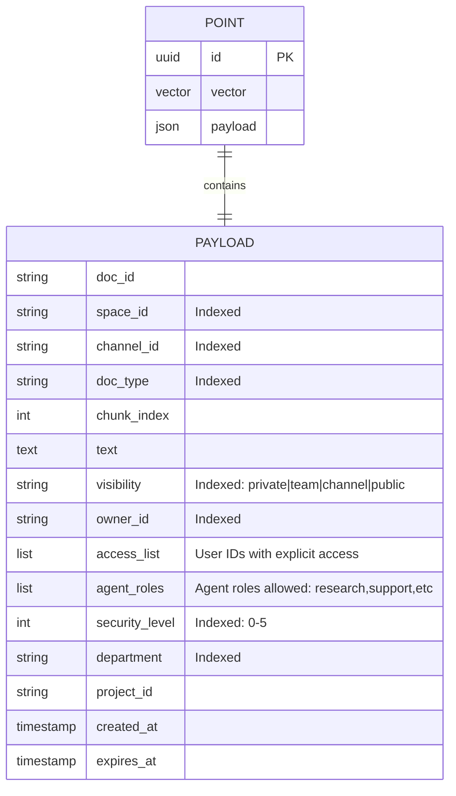

## 🎭 Матрица контроля доступа

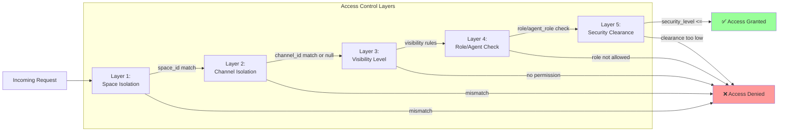

## 🤖 Роли агентов и их доступ

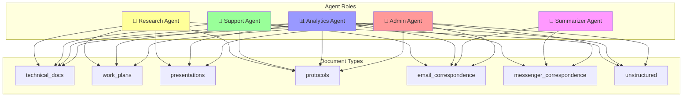

## 📊 Уровни видимости документов

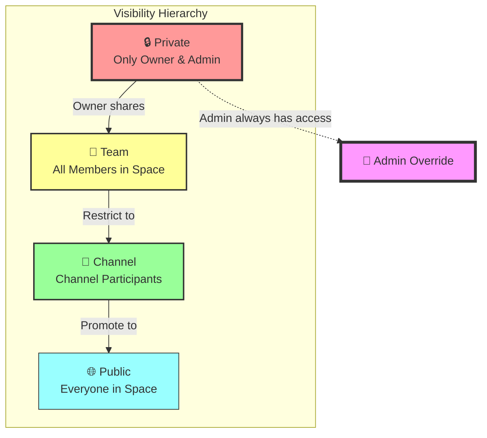

## 🔍 Процесс индексации с ACL

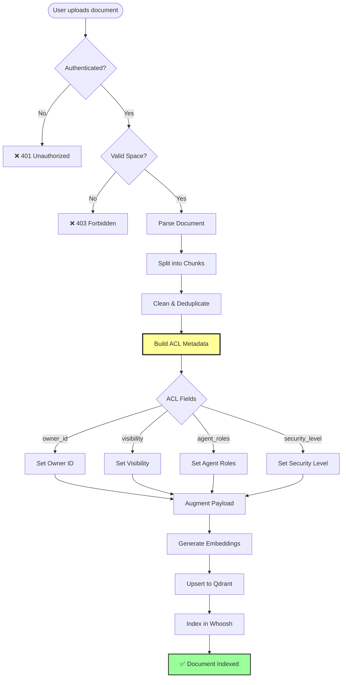

## 🔐 Сценарий: Пользователь делится документом

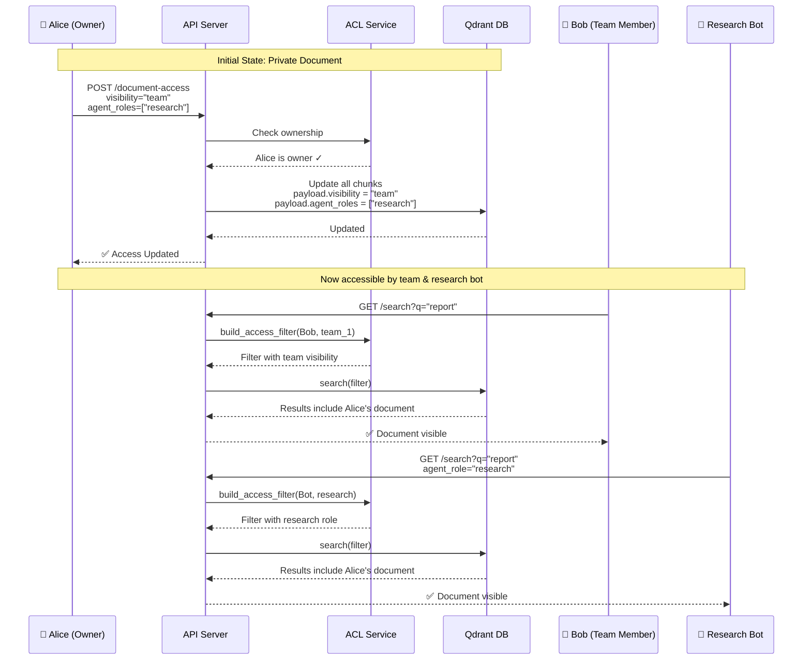

## 🏢 Multi-Tenant Architecture (Hybrid Approach)

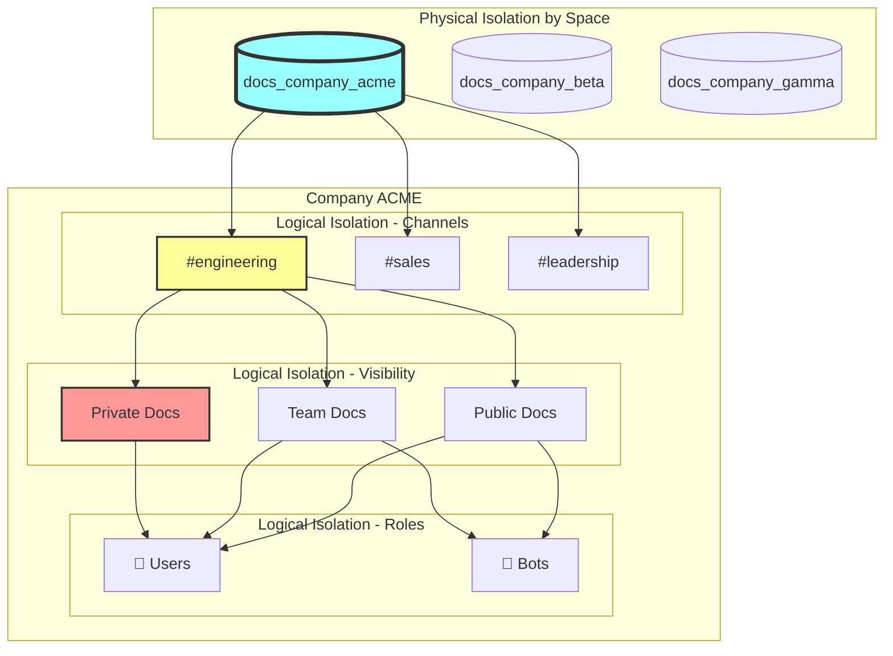

## ⚡ Performance: Indexed vs Non-Indexed Filtering

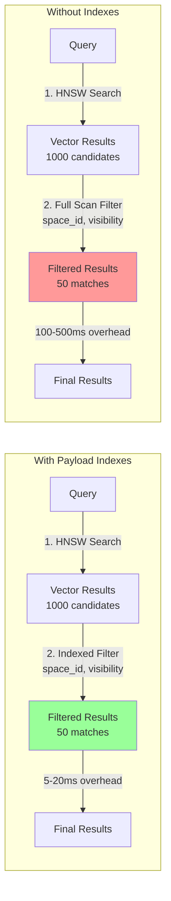

## 🔄 State Transitions: Document Lifecycle

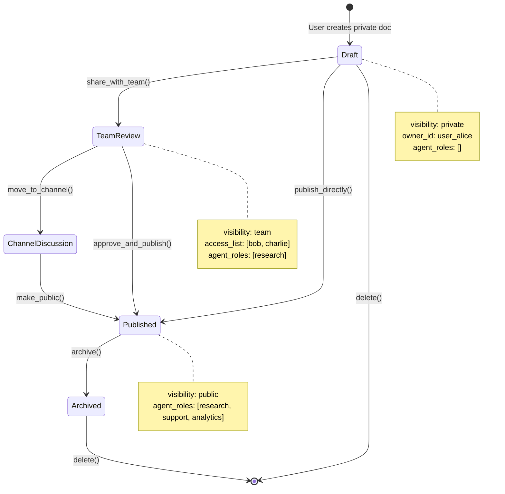

## 🎯 Decision Tree: Can User/Agent Access Document?

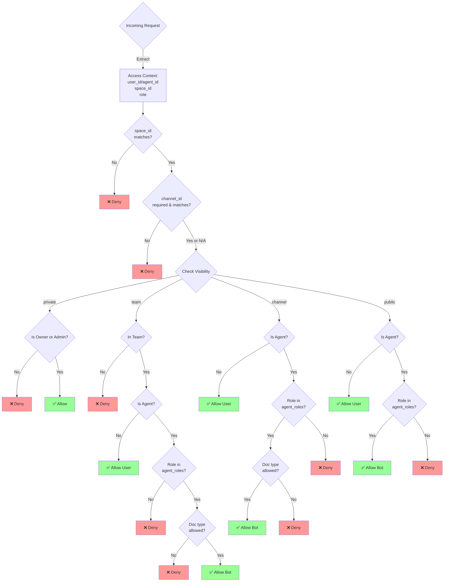

## 📈 Scalability: Growth Scenarios

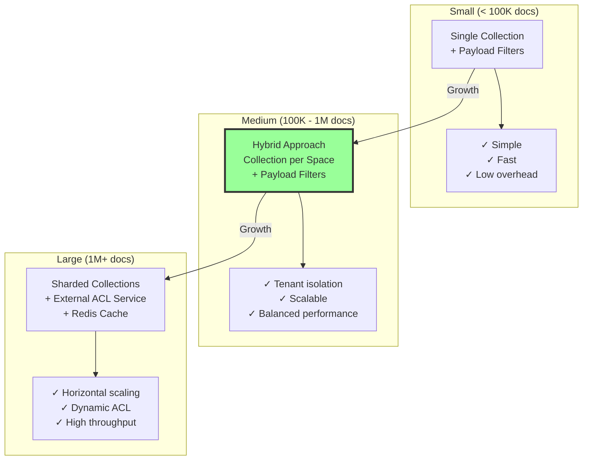

---

## 🛠️ Диаграммы для разработчиков

### Класс-диаграмма: ACL Service

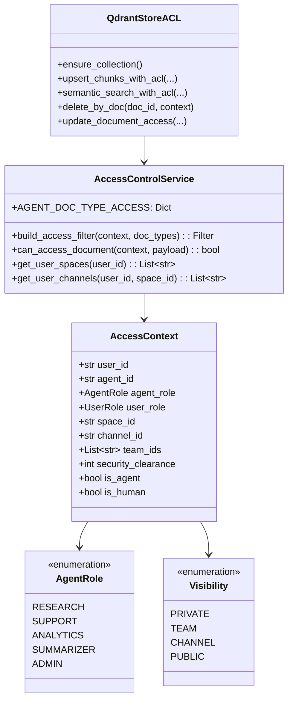

---

## 📝 Легенда символов

- 👤 **User** - Человек-пользователь
- 🤖 **Bot/Agent** - Бот-агент с определенной ролью
- 🔐 **Auth** - Аутентификация и авторизация
- 🔒 **Private** - Приватный документ
- 👥 **Team** - Командный доступ
- 💬 **Channel** - Доступ на уровне канала
- 🌐 **Public** - Публичный доступ
- ✅ **Allow** - Доступ разрешен
- ❌ **Deny** - Доступ запрещен
- 👑 **Admin** - Администратор с полным доступом

