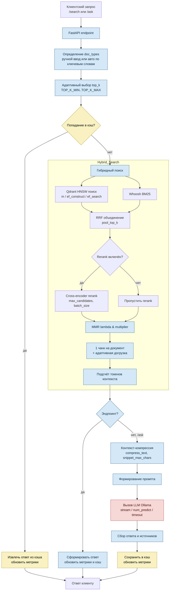

# Pipeline обработки пользовательского запроса

- **Очистка данных при индексации** (CLI/API ingestion): `split_markdown` → `clean_chunk` (удаление boilerplate, дублей) → Qdrant/Whoosh.
- **Метрики**: записываются для `/search` и `/ask`, доступны через `GET /metrics` и в блоке `/health`.
- **Кэш**: TTL LRU для обоих эндпоинтов; хранит ответ и предрасчитанные токены.
